# CivicGo Application Flowcharts

## 🏗️ System Architecture Flowchart

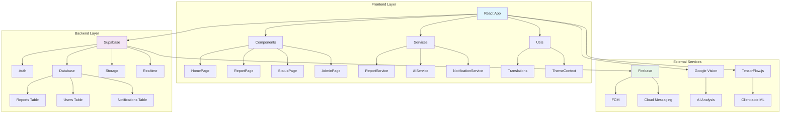

## 🔄 User Journey Flowchart

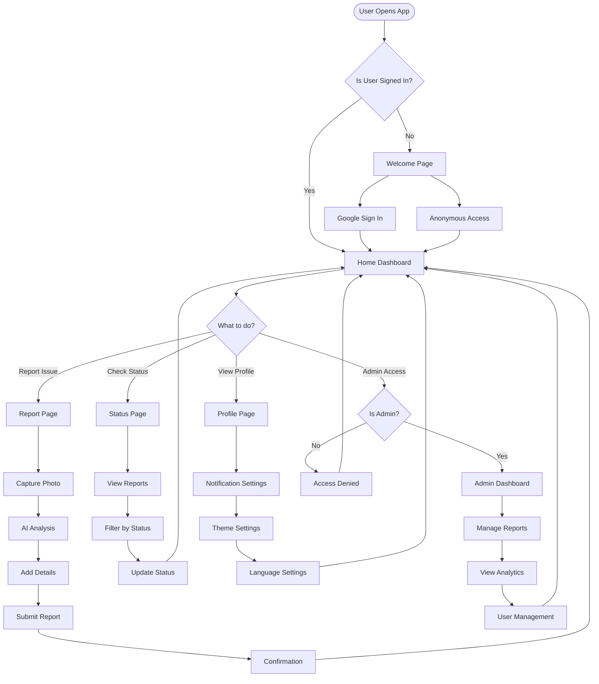

## 📊 Data Flow Architecture

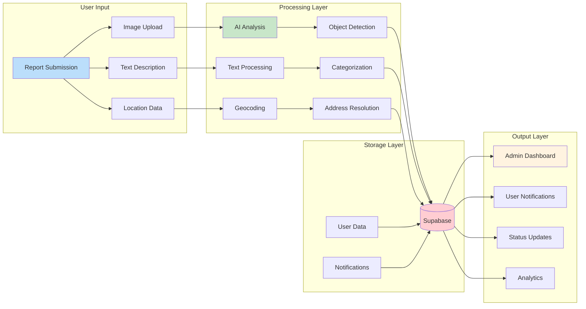

## 🔐 Authentication Flow

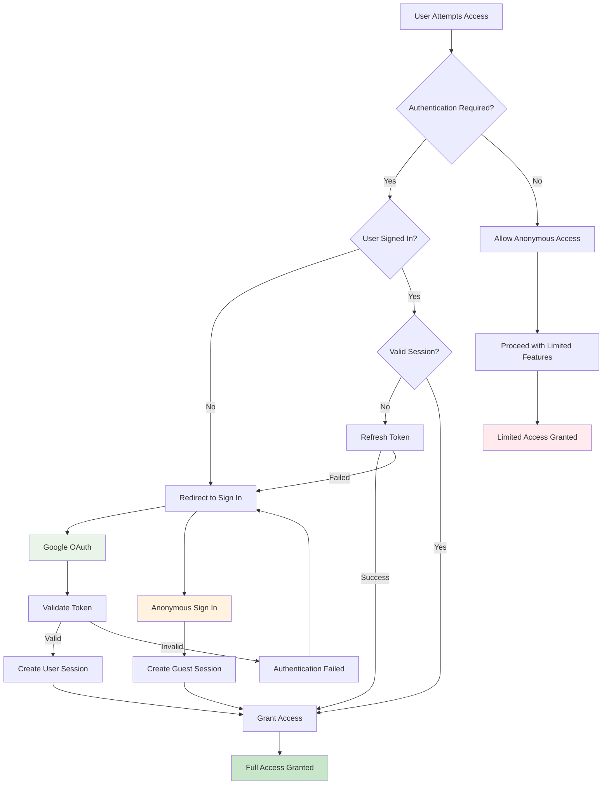

## 🤖 AI Processing Flow

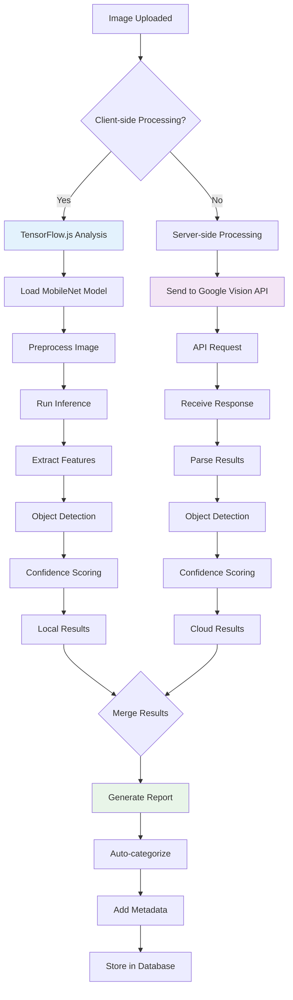

## 📱 Notification Flow

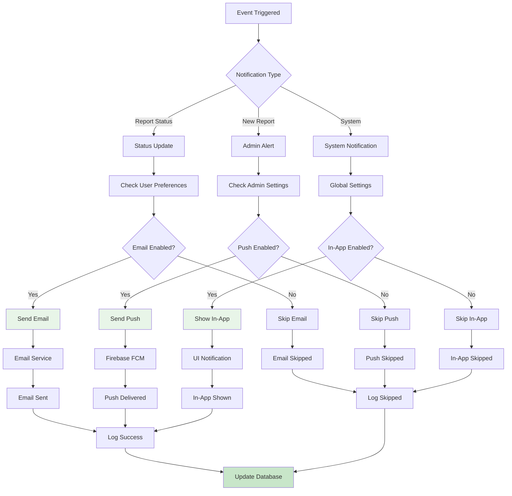

## 🔄 Report Lifecycle Flow

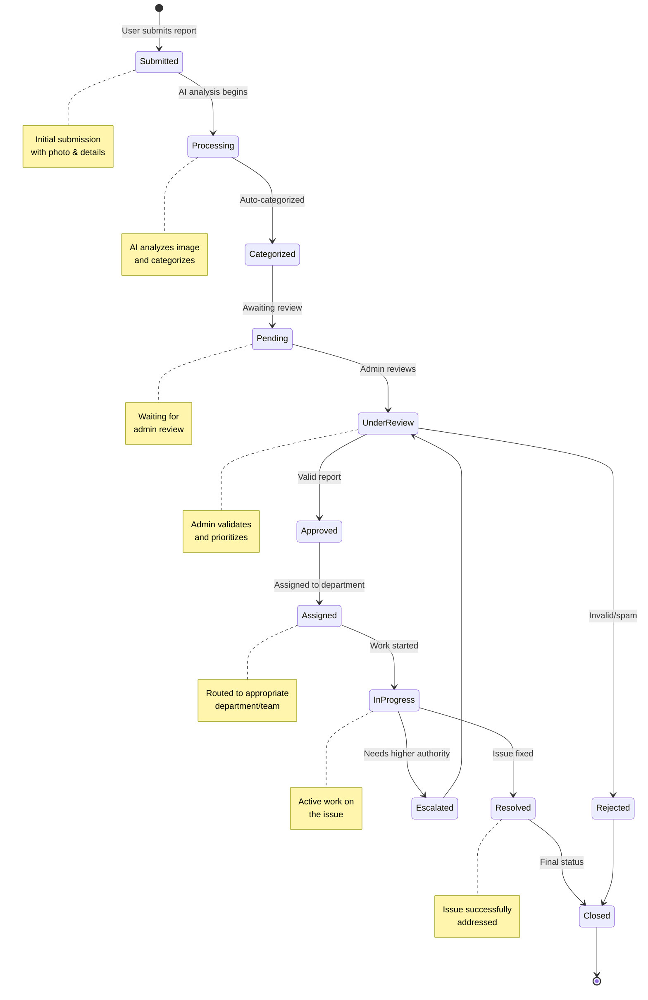

## 📈 Admin Workflow Flow

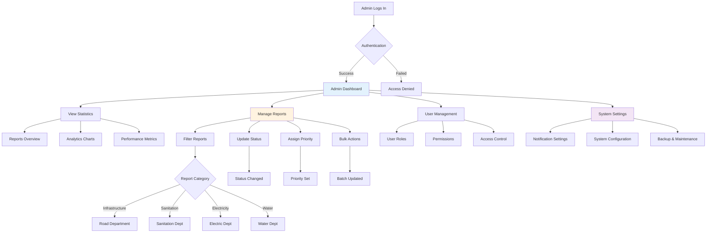

## 🌐 Multi-language Support Flow

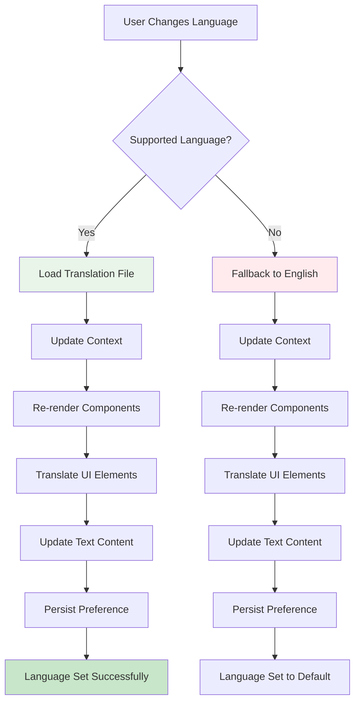

## 🎨 Theme System Flow

```mermaid
flowchart TD
    A[User Toggles Theme] --> B{System Preference?}
    B -->|Yes| C[Detect System Theme]
    B -->|No| D[Use User Preference]

    C --> E{System is Dark?}
    D --> F{User Prefers Dark?}

    E -->|Yes| G[Apply Dark Theme]
    E -->|No| H[Apply Light Theme]
    F -->|Yes| G
    F -->|No| H

    G --> I[Update CSS Variables]
    H --> J[Update CSS Variables]

    I --> K[Update Components]
    J --> L[Update Components]

    K --> M[Persist Theme Choice]
    L --> N[Persist Theme Choice]

    M --> O[Theme Applied Successfully]
    N --> P[Theme Applied Successfully]

    style G fill:#424242
    style H fill:#ffffff
    style O fill:#c8e6c9
```

## 🔍 Search & Filter Flow

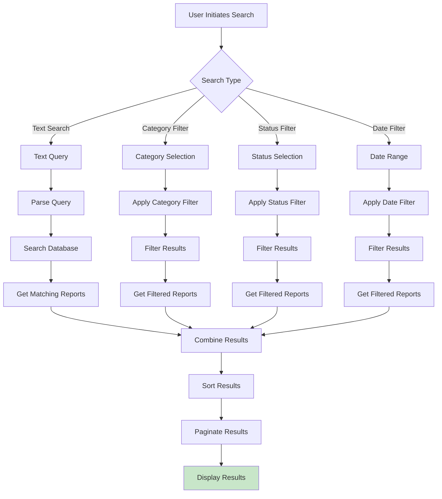

## 📊 Analytics & Reporting Flow

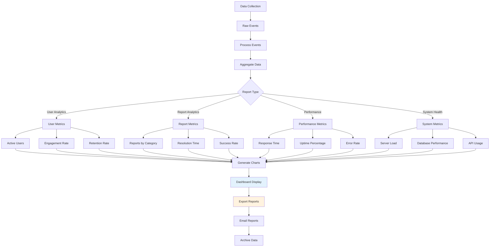

## 🔧 Error Handling Flow

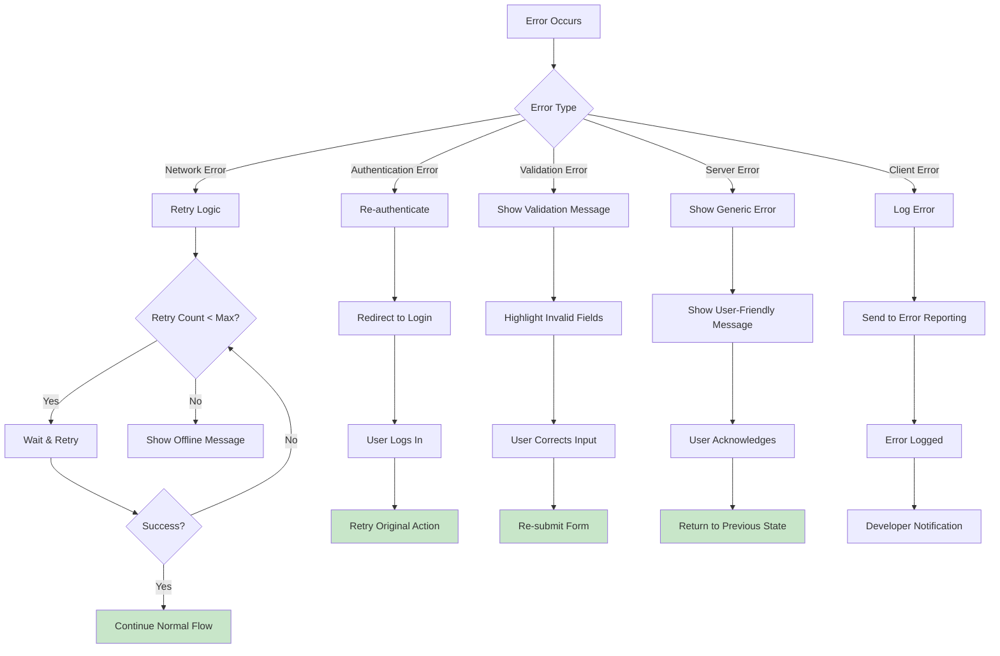

## 🚀 Deployment Flow

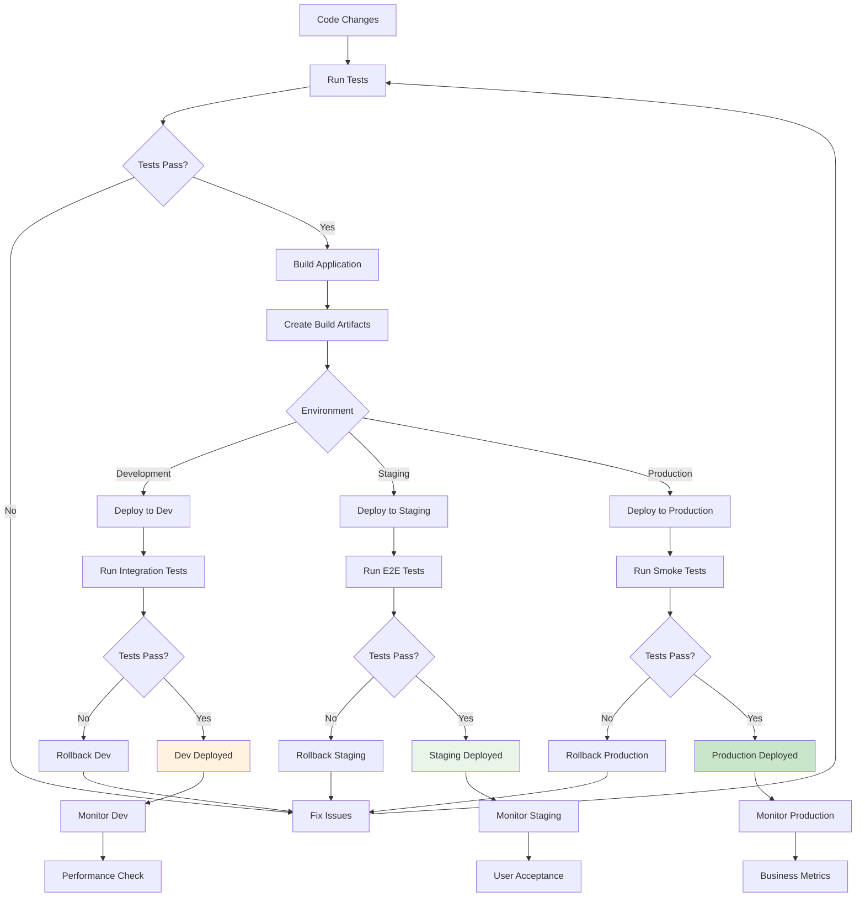

## 📱 Progressive Web App Flow

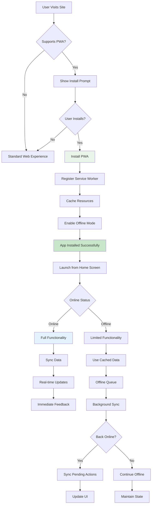

---

## 📋 Flowchart Legend

### Node Types
- **Rectangle**: Process/Action
- **Diamond**: Decision Point
- **Rounded Rectangle**: Start/End Point
- **Cylinder**: Database/Storage
- **Cloud**: External Service

### Colors
- 🔵 **Blue** (`#e3f2fd`): User Interface Components
- 🟢 **Green** (`#e8f5e8`): Successful Operations
- 🟡 **Yellow** (`#fff3e0`): Processing/Analysis
- 🟠 **Orange** (`#ffebee`): External Services
- 🔴 **Red** (`#ffcdd2`): Errors/Failures
- 🟣 **Purple** (`#f3e5f5`): System Components

### Flow Types
- **Solid Line**: Primary Flow
- **Dashed Line**: Alternative/Conditional Flow
- **Thick Line**: Critical Path
- **Thin Line**: Optional/Background Process

---

*These flowcharts provide a comprehensive visual representation of the CivicGo application's architecture, user flows, and system interactions. They serve as both documentation and planning tools for development and maintenance.*
