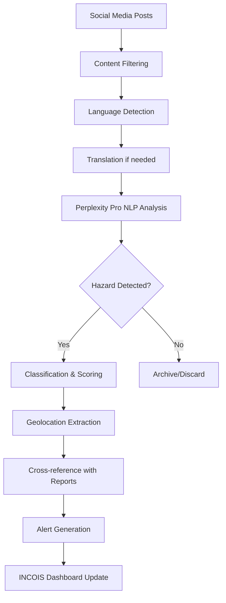

# SagarSetu Social Media Integration & NLP Architecture

## Overview
SagarSetu integrates advanced social media monitoring and NLP capabilities to detect ocean hazards from public social media posts, providing early warning intelligence for INCOIS and coastal communities.

## Architecture Components

### 1. Social Media Data Collection
- **Twitter/X API Integration**: Real-time tweet monitoring with keyword filtering
- **Facebook Graph API**: Public post analysis and community insights
- **YouTube Data API**: Video content analysis for marine incidents
- **WhatsApp/Telegram**: Integration for community group monitoring (future)

### 2. NLP Processing Pipeline
All NLP tasks are powered by **Perplexity Pro** as the primary AI service, providing:

#### Ocean Hazard Classification
```javascript
// Example classification categories
const OCEAN_HAZARD_TYPES = {
  'tsunami_events': ['tsunami', 'tidal wave', 'seismic wave', 'earthquake wave'],
  'storm_surge': ['storm surge', 'cyclone flooding', 'hurricane flood'],
  'high_waves': ['high waves', 'dangerous waves', 'rough sea', 'big waves'],
  'swell_surges': ['swell', 'harbor oscillation', 'seiche', 'standing wave'],
  'coastal_currents': ['rip current', 'undertow', 'dangerous current'],
  'coastal_erosion': ['beach erosion', 'cliff erosion', 'shoreline damage'],
  'marine_debris': ['oil spill', 'marine pollution', 'floating debris'],
  'unusual_sea_behavior': ['red tide', 'algae bloom', 'dead fish', 'sea foam']
};
```

#### Sentiment Analysis
- **Panic Detection**: Identifies posts indicating community panic or distress
- **Urgency Scoring**: 1-5 scale based on language intensity and context
- **Confidence Metrics**: AI confidence in classification accuracy

#### Multilingual Support
- **Primary Languages**: English, Hindi, Tamil, Telugu, Malayalam, Marathi, Gujarati, Bengali, Odia
- **Regional Terminology**: Coastal and fishing community-specific terms
- **Translation Pipeline**: Automatic translation to English for analysis

### 3. Data Processing Workflow



### 4. Real-time Processing Features

#### Keyword Monitoring
```javascript
const MONITORING_KEYWORDS = {
  // Ocean hazards
  tsunami: ['tsunami', 'tidal wave', 'लहरें', 'அலை', 'సునామి'],
  cyclone: ['cyclone', 'storm', 'तूफान', 'புயல்', 'తుఫాను'],
  waves: ['high waves', 'dangerous waves', 'ऊंची लहरें', 'பெரிய அலைகள்'],
  
  // Safety terms
  emergency: ['emergency', 'rescue', 'help', 'मदद', 'உதவி', 'సహాయం'],
  danger: ['danger', 'warning', 'alert', 'खतरा', 'ஆபத்து', 'ప్రమాదం'],
  
  // Location-specific
  coastal: ['beach', 'coast', 'shore', 'तट', 'கடற்கரை', 'తీరం'],
  marine: ['sea', 'ocean', 'water', 'समुद्र', 'கடல்', 'సముద్రం']
};
```

#### Geolocation Intelligence
- **Location Extraction**: Extract coastal locations from post content
- **Coordinate Mapping**: Convert place names to GPS coordinates
- **Coastal Zone Classification**: Map to INCOIS coastal zone boundaries
- **Hotspot Generation**: Cluster related posts by geographic proximity

### 5. Data Storage & Analytics

#### Social Media Posts Table
```sql
CREATE TABLE social_media_posts (
    id UUID PRIMARY KEY,
    platform VARCHAR(30) NOT NULL,
    content TEXT NOT NULL,
    
    -- NLP Analysis Results
    hazard_classification VARCHAR(50),
    sentiment_score DECIMAL(4,3), -- -1 to 1
    urgency_level INTEGER, -- 1 to 5
    confidence_score DECIMAL(3,2), -- 0 to 1
    panic_indicator BOOLEAN,
    
    -- Geolocation data
    location JSONB,
    coastal_zone VARCHAR(100),
    
    -- Engagement metrics
    likes_count INTEGER DEFAULT 0,
    shares_count INTEGER DEFAULT 0,
    engagement_rate DECIMAL(5,4)
);
```

#### Analytics & Reporting
- **Trend Analysis**: Track hazard mention frequency over time
- **Geographic Distribution**: Heat maps of social media activity
- **Sentiment Tracking**: Monitor public mood during emergencies
- **False Positive Detection**: Machine learning to reduce noise

### 6. Integration with INCOIS Systems

#### Real-time Alerts
```javascript
const generateAlert = (socialPost) => {
  if (socialPost.urgency_level >= 4 && 
      socialPost.confidence_score >= 0.8 &&
      socialPost.panic_indicator) {
    
    return {
      alert_type: 'HIGH_PRIORITY_SOCIAL',
      hazard_type: socialPost.hazard_classification,
      location: socialPost.location,
      content_summary: socialPost.content.substring(0, 200),
      recommended_action: 'VERIFY_AND_INVESTIGATE',
      estimated_reach: socialPost.engagement_metrics.estimated_reach
    };
  }
};
```

#### Early Warning Correlation
- **Cross-validation**: Compare social media alerts with sensor data
- **Pattern Recognition**: Identify emerging patterns across platforms
- **Timeline Reconstruction**: Build event timelines from multiple sources
- **Impact Assessment**: Estimate affected population based on post density

### 7. API Endpoints for Integration

#### Social Media Monitoring API
```javascript
// Start monitoring for specific keywords and regions
POST /api/social-media/monitor
{
  "keywords": ["tsunami", "high waves", "storm surge"],
  "regions": ["Tamil Nadu", "Andhra Pradesh", "West Bengal"],
  "languages": ["en", "hi", "ta", "te", "bn"],
  "urgency_threshold": 3
}

// Get real-time social media alerts
GET /api/social-media/alerts
Query params:
- urgency_level (1-5)
- hazard_type
- coastal_zone
- hours_back (default: 24)

// Analyze specific post content
POST /api/social-media/analyze
{
  "content": "Large waves hitting Chennai marina, people running",
  "location": {"lat": 13.0827, "lng": 80.2707},
  "platform": "twitter"
}
```

### 8. Performance Optimization

#### Caching Strategy
- **Redis Cache**: Store frequently accessed classifications
- **Batch Processing**: Process posts in batches for efficiency
- **Rate Limiting**: Respect social media API limits
- **Priority Queue**: Prioritize high-urgency posts

#### Scalability Features
- **Horizontal Scaling**: Multiple worker nodes for processing
- **Load Balancing**: Distribute API calls across endpoints
- **Database Sharding**: Partition data by geographic regions
- **CDN Integration**: Cache static analysis results

### 9. Privacy & Ethics

#### Data Handling
- **Public Posts Only**: Only analyze publicly available content
- **Anonymization**: Remove personal identifiers from stored data
- **Retention Policy**: Automatic deletion after specified periods
- **Compliance**: GDPR and local privacy law compliance

#### Content Moderation
- **Fake News Detection**: Identify potentially misleading information
- **Source Credibility**: Weight posts by account verification status
- **Human Oversight**: Flagging system for manual review
- **Transparency**: Clear guidelines on data usage

### 10. Monitoring & Maintenance

#### System Health Metrics
- **Processing Latency**: Time from post collection to analysis
- **Accuracy Metrics**: False positive/negative rates
- **API Response Times**: Monitor external service performance
- **Storage Utilization**: Database and cache usage tracking

#### Alerting & Notifications
- **System Failures**: Immediate alerts for service disruptions
- **Threshold Breaches**: Alerts when hazard levels exceed limits
- **Performance Degradation**: Early warning for system slowdowns
- **Data Quality Issues**: Alerts for classification accuracy drops

## Implementation Priorities

### Phase 1 (Immediate - MVP)
1. Twitter API integration with basic keyword filtering
2. Perplexity Pro NLP integration for hazard classification
3. Basic geolocation extraction and mapping
4. Simple alert generation for high-confidence posts

### Phase 2 (3-6 months)
1. Facebook and YouTube API integration
2. Advanced sentiment analysis and panic detection
3. Multilingual support for major coastal state languages
4. Integration with existing INCOIS early warning systems

### Phase 3 (6-12 months)
1. Machine learning model training on collected data
2. Predictive analytics for hazard forecasting
3. Advanced correlation with sensor data
4. Mobile app integration for community alerts

## Success Metrics

- **Detection Speed**: Hazard identification within 15 minutes of social media post
- **Accuracy Rate**: >85% correct hazard classification
- **Coverage**: Monitor posts from all major coastal cities
- **Response Time**: Generate alerts within 5 minutes of detection
- **False Positive Rate**: <10% of generated alerts

This comprehensive social media integration system will provide INCOIS with unprecedented early warning capabilities, leveraging the power of community-generated content to enhance maritime safety across India's extensive coastline.